# UML – Station ONT Zarzis (Exports)

- Use cases : 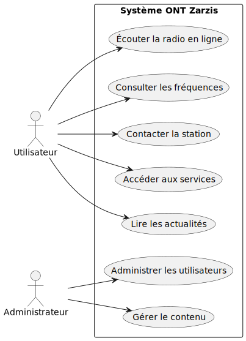
- Classes : 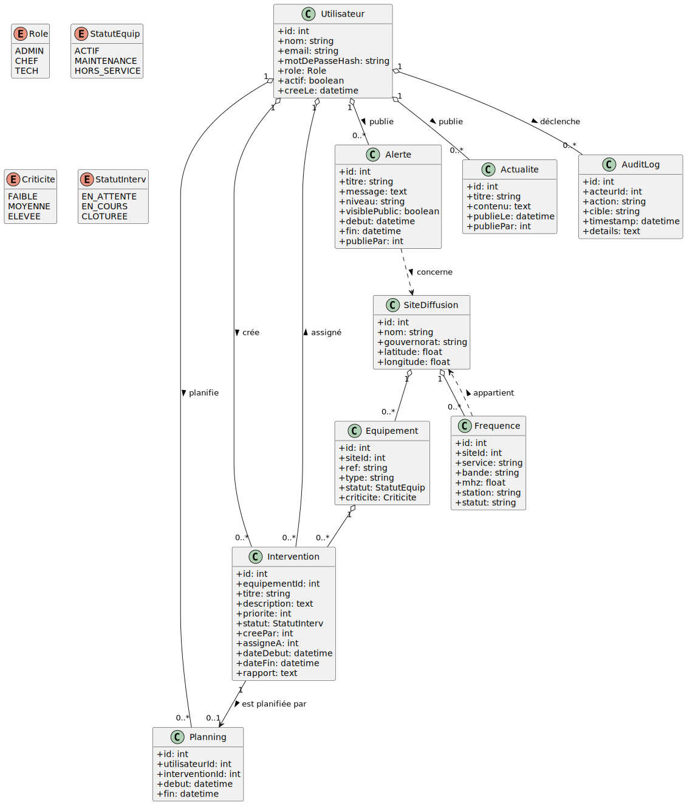
- ERD : 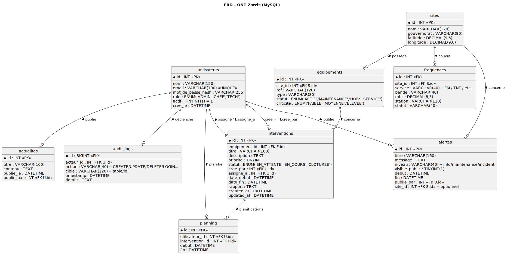
- Séquences :
  - Création & assignation : 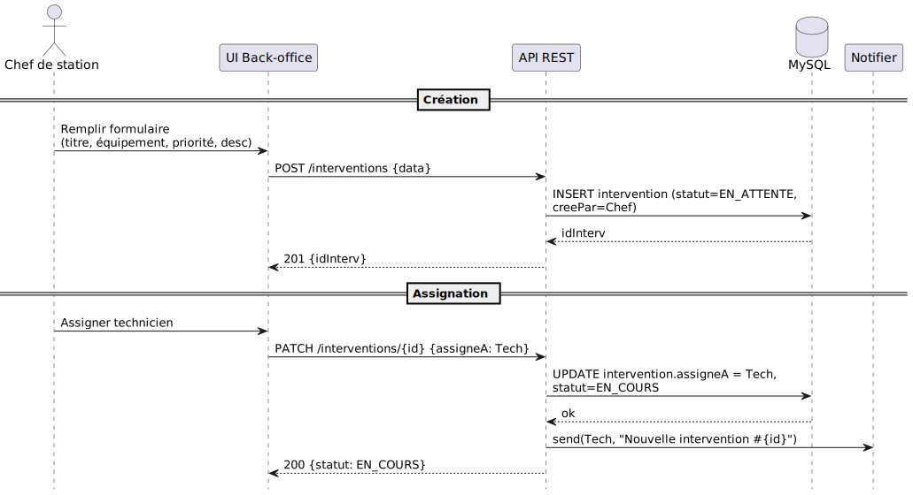
  - Clôture : 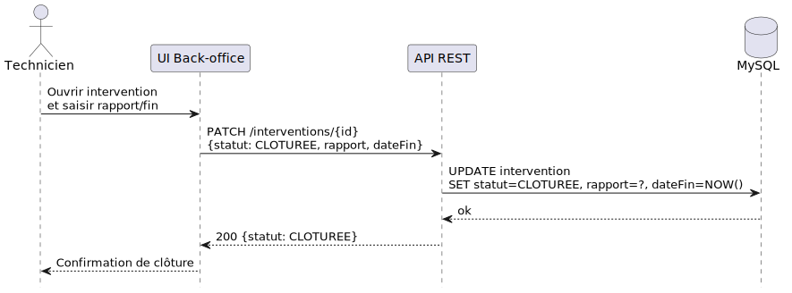
  - Consultation fréquences : 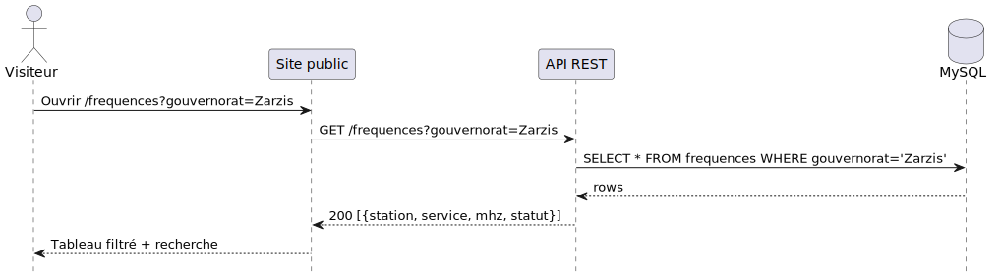
- Communication :
  - Création & assignation : 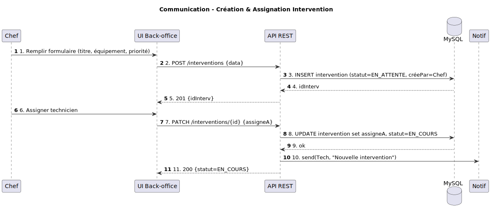
  - Clôture : 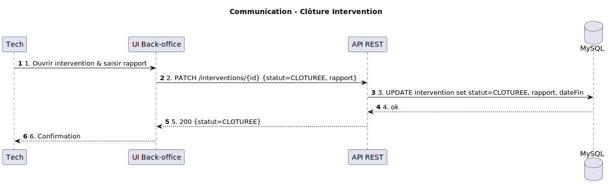
- Activité (workflow intervention) : 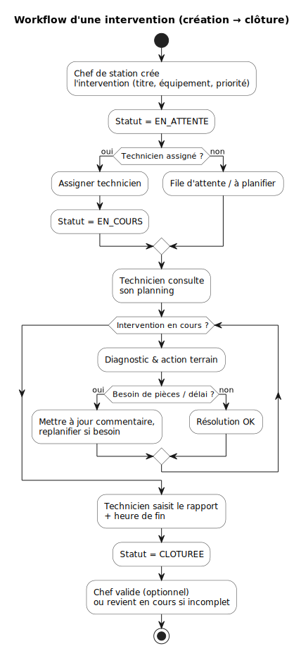
- États (Intervention) : 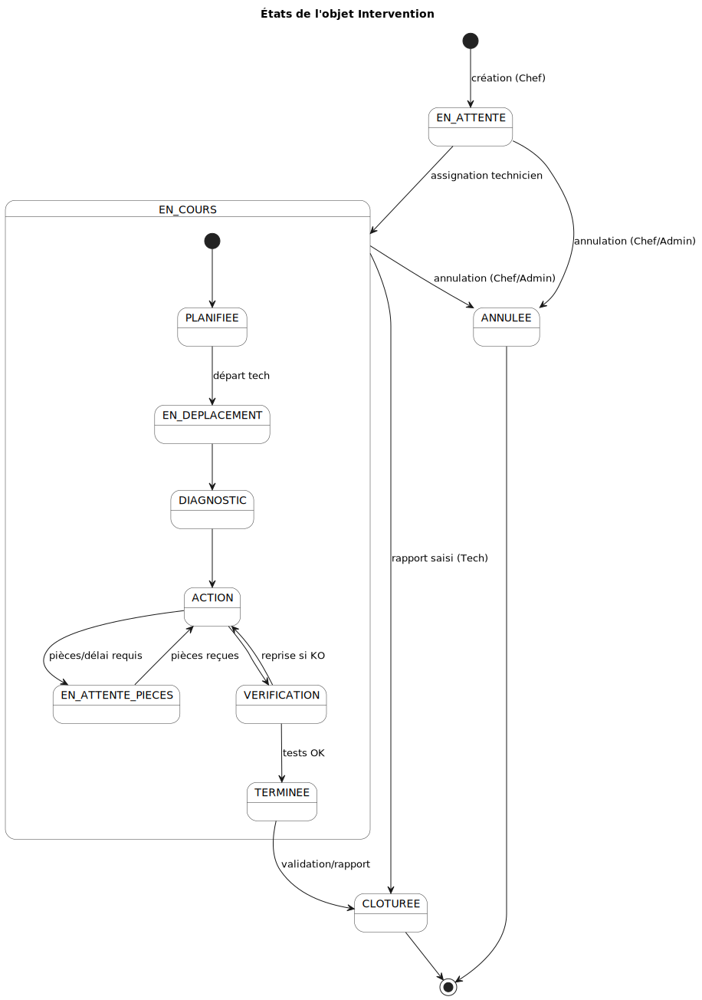
- Composants : 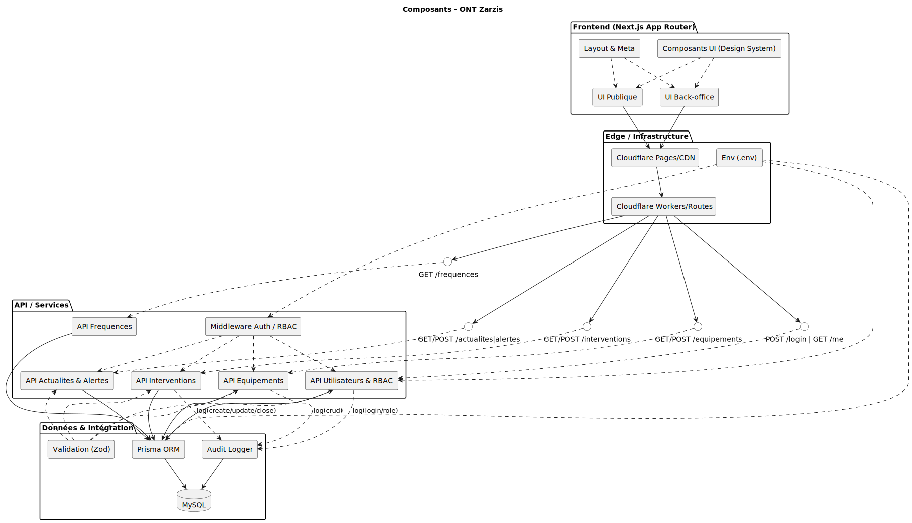
- Déploiement : 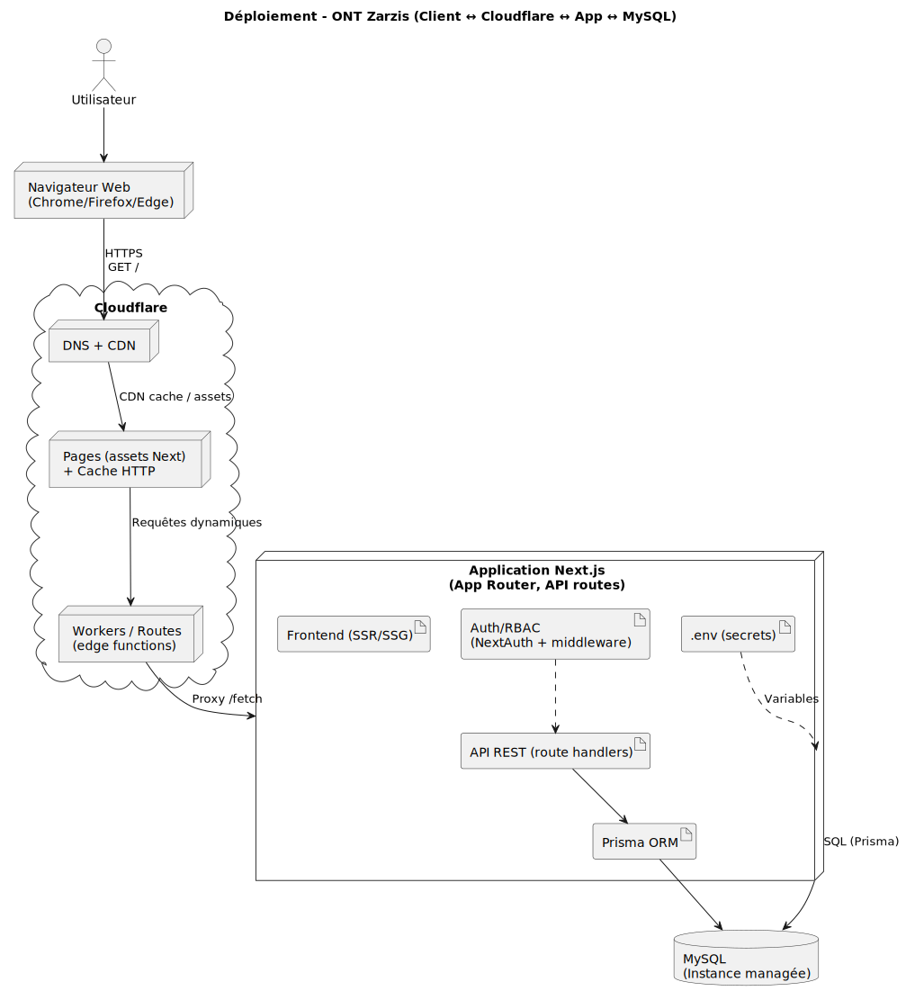
